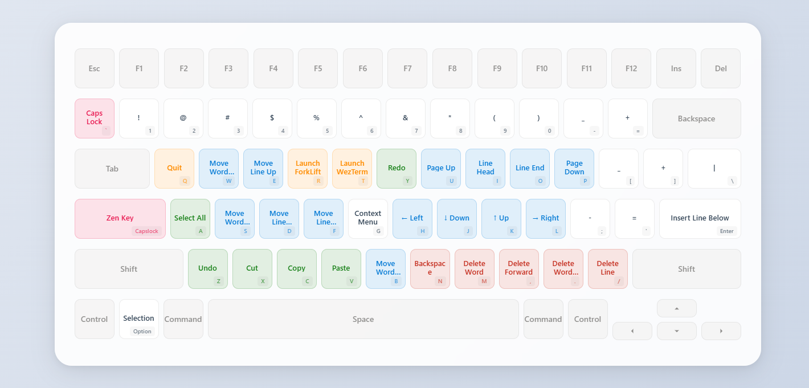
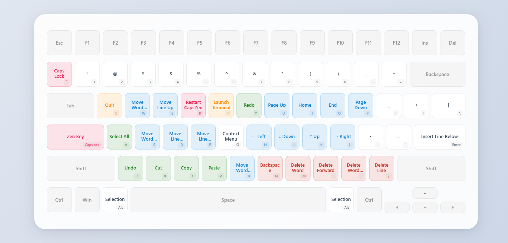

<!-- markdownlint-disable MD028 MD033 MD036 MD041 -->

  
  <h1>CapsZen</h1>
  
<strong>将 CapsLock 键转换为强大的修饰键，用于导航和编辑</strong>

  
  [English](README.md) | 中文
  
  
  
  

---

## 📖 项目简介

CapsZen 是一个适用于 Windows (AHK) 和 macOS (Karabiner) 的热键系统，使用 CapsLock 进行统一导航、文本编辑和特殊字符输入。

> 访问 [交互式键盘预设](https://ziyuz.github.io/CapsZen) 预览所有快捷键功能

  

Windows Keymap

  

### ✨ 主要特性

- **🖥️ 跨平台支持** - 同时支持 macOS 和 Windows, 使用统一的操作逻辑
- **⚡ 即时导航** - HJKL 方向键、页面上下、行首行尾
- **✂️ 快速编辑** - 复制、粘贴、撤销、全选等快捷键
- **🚀 应用启动** - 一键启动常用应用程序 (Windows: 任务栏的第一个程序, macOS: WezTerm 和 ForkLift, 可自定义)
- **🎨 可视化参考** - 交互式键盘映射图显示所有快捷键
- **🔧 高度可定制** - 可根据个人工作流程调整按键绑定

## 🚀 快速开始

### 系统要求

- **macOS**: 需要安装 Karabiner-Elements
- **Windows**: 若执行 `CapsZen.ahk` 需要安装 AutoHotkey V2, 若执行 `CapsZen.exe` 则需要 64 位 Windows 系统

### 下载

| 平台 | 下载链接 |
|------|----------|
| macOS | [CapsZen.json](https://github.com/ZiyuZ/CapsZen/releases/latest/download/CapsZen.json) |
| Windows | [CapsZen.ahk (Autohotkey V2)](https://github.com/ZiyuZ/CapsZen/releases/latest/download/CapsZen.ahk)   [CapsZen.exe (x64)](https://github.com/ZiyuZ/CapsZen/releases/latest/download/CapsZen.exe) |

### 安装步骤

#### macOS 用户

1. 安装 [Karabiner-Elements](https://karabiner-elements.pqrs.org/)
2. 下载 `CapsZen.json` 配置文件
3. 在 Karabiner-Elements 中导入配置文件
    1. 将配置文件复制到 Karabiner 规则导入位置, 通常是 `~/.config/karabiner/assets/complex_modifications`
    2. 在 Karabiner 的 `Complex Modifications` 中点击 `Add predefined rule`, 找到 CapsZen 并点击 `Enable`
4. 启用配置

#### Windows 用户

> [!TIP]
> 如需设置开机启动:
>
> 1. 打开运行对话框 <kbd>Win</kbd> + <kbd>R</kbd>
> 2. 输入 `shell:startup` 并按 Enter
> 3. 将应用或应用快捷方式拖放到打开的文件夹中

##### AHK 脚本方式

1. 安装 [AutoHotkey V2](https://www.autohotkey.com/)
2. 下载 `CapsZen.ahk` 脚本文件
3. 双击运行脚本

##### 可执行文件

1. 下载 `CapsZen.exe`
2. 双击运行脚本

## ⌨️ 快捷键参考

### 导航快捷键

| 按键 | macOS 功能 | Windows 功能 | 备注 |
|------|------------|--------------|------|
| <kbd>CapsLock</kbd> + <kbd>H</kbd> | 左移 | 左移 | 光标向左移动 |
| <kbd>CapsLock</kbd> + <kbd>J</kbd> | 下移 | 下移 | 光标向下移动 |
| <kbd>CapsLock</kbd> + <kbd>K</kbd> | 上移 | 上移 | 光标向上移动 |
| <kbd>CapsLock</kbd> + <kbd>L</kbd> | 右移 | 右移 | 光标向右移动 |
| <kbd>CapsLock</kbd> + <kbd>I</kbd> | 行首 | 行首 | 移动到行首 |
| <kbd>CapsLock</kbd> + <kbd>O</kbd> | 行尾 | 行尾 | 移动到行尾 |
| <kbd>CapsLock</kbd> + <kbd>U</kbd> | 上一页 | 上一页 | Page Up |
| <kbd>CapsLock</kbd> + <kbd>P</kbd> | 下一页 | 下一页 | Page Down |
| <kbd>CapsLock</kbd> + <kbd>W</kbd> | 下一词 | 下一词 | 移动到下一个单词 |
| <kbd>CapsLock</kbd> + <kbd>B</kbd> | 上一词 | 上一词 | 移动到上一个单词 |

> [!TIP]
> 在导航时, 同时按下 <kbd>Option</kbd> (macOS) 或者 <kbd>Alt</kbd> (Windows) 将会起到选中的效果, 类似于按下 <kbd>Shift</kbd> (因为同时按下 <kbd>CapsLock</kbd> 和 <kbd>Shift</kbd> 有点困难)

> [!NOTE]
> 在 macOS 下, 不同终端对行首/行尾的移动方式存在一些区别, 本项目仅针对 WezTerm 进行了优化

### 编辑快捷键

| 按键 | macOS 功能 | Windows 功能 | 备注 |
|------|------------|--------------|------|
| <kbd>CapsLock</kbd> + <kbd>Z</kbd> | 撤销 | 撤销 | <kbd>Cmd</kbd>/<kbd>Ctrl</kbd> + <kbd>Z</kbd> |
| <kbd>CapsLock</kbd> + <kbd>Y</kbd> | 重做 | 重做 | <kbd>Cmd</kbd> + <kbd>Shift</kbd> + <kbd>Z</kbd>/<kbd>Ctrl</kbd> + <kbd>Y</kbd>  |
| <kbd>CapsLock</kbd> + <kbd>X</kbd> | 剪切 | 剪切 | <kbd>Cmd</kbd>/<kbd>Ctrl</kbd> + <kbd>X</kbd> |
| <kbd>CapsLock</kbd> + <kbd>C</kbd> | 复制 | 复制 | <kbd>Cmd</kbd>/<kbd>Ctrl</kbd> + <kbd>C</kbd> |
| <kbd>CapsLock</kbd> + <kbd>V</kbd> | 粘贴 | 粘贴 | <kbd>Cmd</kbd>/<kbd>Ctrl</kbd> + <kbd>V</kbd> |
| <kbd>CapsLock</kbd> + <kbd>A</kbd> | 全选 | 全选 | <kbd>Cmd</kbd>/<kbd>Ctrl</kbd> + <kbd>A</kbd> |
| <kbd>CapsLock</kbd> + <kbd>G</kbd> | 右键菜单 | 右键菜单 | 上下文菜单, macOS在鼠标位置, Windows在光标位置 |
| <kbd>CapsLock</kbd> + <kbd>Enter</kbd> | 行尾换行 | 行尾换行 | 在行尾插入新行 |

### 删除快捷键

| 按键 | macOS 功能 | Windows 功能 | 备注 |
|------|------------|--------------|------|
| <kbd>CapsLock</kbd> + <kbd>N</kbd> | 退格 | 退格 | 删除前一个字符 |
| <kbd>CapsLock</kbd> + <kbd>M</kbd> | 删除前词 | 删除前词 | 删除前一个单词 |
| <kbd>CapsLock</kbd> + <kbd>,</kbd> | 删除 | 删除 | 删除后一个字符 |
| <kbd>CapsLock</kbd> + <kbd>.</kbd> | 删除后词 | 删除后词 | 删除后一个单词 |
| <kbd>CapsLock</kbd> + <kbd>/</kbd> | 删除行 | 删除行 | 删除整行   在 macOS 下的 VSCode 中使用 <kbd>Cmd</kbd> + <kbd>Shift</kbd> + <kbd>K</kbd> 快捷键 |

### 应用启动快捷键

| 按键 | macOS 功能 | Windows 功能 | 备注 |
|------|------------|--------------|------|
| <kbd>CapsLock</kbd> + <kbd>T</kbd> | 启动 WezTerm | 启动任务栏第一个应用 (<kbd>Windows</kbd> + <kbd>1</kbd>) | 终端应用 |
| <kbd>CapsLock</kbd> + <kbd>R</kbd> | 启动 ForkLift | 重新加载脚本 | macOS: 文件管理器 / Windows: 重新加载 |

### 符号快捷键

> 避免长距离移动小拇指

| 按键 | macOS 功能 | Windows 功能 | 备注 |
|------|------------|--------------|------|
| <kbd>CapsLock</kbd> + <kbd>;</kbd> | - | - |  |
| <kbd>CapsLock</kbd> + <kbd>'</kbd> | = | = |  |
| <kbd>CapsLock</kbd> + <kbd>[</kbd> | _ | _ |  |
| <kbd>CapsLock</kbd> + <kbd>]</kbd> | + | + |  |
| <kbd>CapsLock</kbd> + <kbd>\\</kbd> | \| | \| |  |

### 数字快捷键

> 类似 <kbd>Shift</kbd>

| 按键 | macOS 功能 | Windows 功能 | 备注 |
|------|------------|--------------|------|
| <kbd>CapsLock</kbd> + <kbd>1</kbd> | ! | ! |  |
| <kbd>CapsLock</kbd> + <kbd>2</kbd> | @ | @ |  |
| <kbd>CapsLock</kbd> + <kbd>3</kbd> | # | # |  |
| <kbd>CapsLock</kbd> + <kbd>4</kbd> | $ | $ |  |
| <kbd>CapsLock</kbd> + <kbd>5</kbd> | % | % |  |
| <kbd>CapsLock</kbd> + <kbd>6</kbd> | ^ | ^ |  |
| <kbd>CapsLock</kbd> + <kbd>7</kbd> | & | & |  |
| <kbd>CapsLock</kbd> + <kbd>8</kbd> | * | * |  |
| <kbd>CapsLock</kbd> + <kbd>9</kbd> | ( | ( |  |
| <kbd>CapsLock</kbd> + <kbd>0</kbd> | ) | ) |  |

### 特殊功能

| 按键 | macOS 功能 | Windows 功能 | 备注 |
|------|------------|--------------|------|
| <kbd>CapsLock</kbd> + <kbd>`</kbd> | 切换大小写 | 切换大小写 | 临时启用/禁用 CapsLock |
| <kbd>CapsLock</kbd> + <kbd>Q</kbd> | 退出应用 | 退出应用 | <kbd>Cmd</kbd> + <kbd>Q</kbd>/<kbd>Alt</kbd> + <kbd>F4</kbd> |
| <kbd>CapsLock</kbd> + 滚轮上 | - | 音量+ | 调节音量 |
| <kbd>CapsLock</kbd> + 滚轮下 | - | 音量- | 调节音量 |

<!-- ### 鼠标侧键功能 (仅Windows)

| 按键 | 功能 | 备注 |
|------|------|------|
| <kbd>XButton2</kbd> | 鼠标中键 | 远端侧键 |
| <kbd>XButton2</kbd> + 滚轮上 | 上一标签页 | Ctrl + Page Up |
| <kbd>XButton2</kbd> + 滚轮下 | 下一标签页 | Ctrl + Page Down |
| <kbd>XButton2</kbd> + 右键 | 浏览器前进 | 浏览器前进 |
| <kbd>XButton2</kbd> + 左键 | 返回上级目录 | Alt + Up |
| <kbd>XButton1</kbd> | 鼠标中键 | 近端侧键 |
| <kbd>XButton1</kbd> + 滚轮下 | Alt + Tab | 窗口切换 |
| <kbd>XButton1</kbd> + 滚轮上 | Shift + Alt + Tab | 反向窗口切换 |
| <kbd>XButton1</kbd> + 中键 | Escape | 取消窗口切换 |
| <kbd>XButton1</kbd> + 左键 | 虚拟桌面左移 | Win + Ctrl + Left |
| <kbd>XButton1</kbd> + 右键 | 虚拟桌面右移 | Win + Ctrl + Right | -->

## 💫 自定义

### Windows

1. 修改 `CapsZen.ahk`
2. 启动脚本
    - 如果当前处于启动状态, 按下 <kbd>CapsLock</kbd> + <kbd>R</kbd>
    - 如果当前未启动, 双击脚本启动
3. 编译为可执行文件
    - 启动 Autohotkey Dash, 选择 `Compile`
    - 选择脚本文件和可执行文件目标生成位置
    - 选择图标, 位于本项目 `/docs/assets/CapsZen.ico`
    - 选择对应系统版本的 Base File
    - 点击 `Convert`

### macOS

1. 修改 `CapsZen.yml`
2. 执行 `uv run converter.py CapsZen.yml -o CapsZen.json`
    - 需要安装 [uv](https://docs.astral.sh/uv/)
3. 将 `CapsZen.json` 复制到 Karabiner 外部规则导入目录
4. 导入并启用 CapsZen 规则

## 💡 使用场景

### 编程开发

- 使用 HJKL 进行精确的光标导航
- 快速在单词间跳转 (W/B)
- 一键删除单词或整行
- 快速启动终端和文件管理器

### 文档编辑

- 复制粘贴操作更高效
- 快速选择文本 (配合 Option 或 Alt)
- 撤销重做操作
- 符号输入更便捷

## 📄 许可证

本项目采用 MIT 许可证 ([LICENSE](LICENSE))。

## 🙏 致谢

CapsZen 的灵感来源于以下优秀的开源项目：

- **[matrix1001/capslock-plus-plus](https://github.com/matrix1001/capslock-plus-plus)**
- **[Vonng/Capslock](https://github.com/Vonng/Capslock)**

---

  
⭐ 如果这个项目对你有帮助，请给我们一个 Star！

